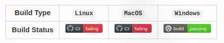
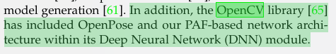
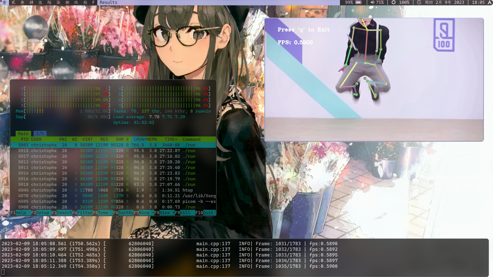
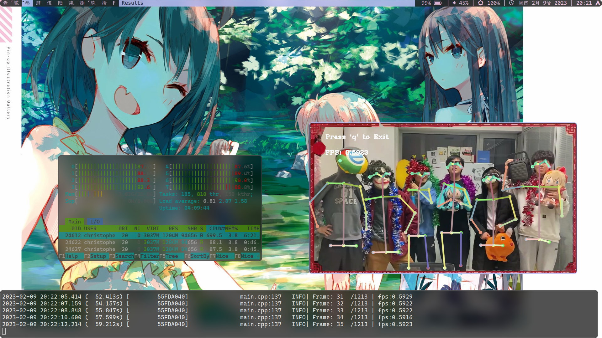
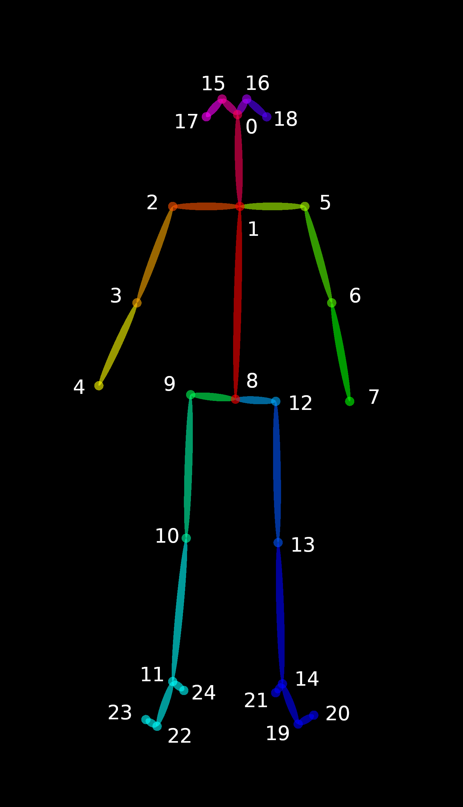
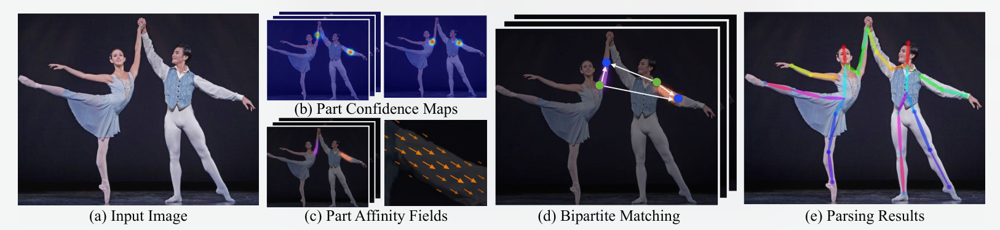

## Background and Demonstrations
* Since the official [`OpenPose`](https://github.com/CMU-Perceptual-Computing-Lab/openpose) Repo cannot be successfully built on macOS and Linux, I decide to integrate with the `OpenCV`'s `cv::dnn` module which is compatible with the `OpenPose` Network Architecture as is discussed in `OpenPose` thesis to play with `OpenPose` model which will be used for our future work.

<center>
  <br>
  <div style="color:orange; border-bottom: 1px solid #d9d9d9;display: inline-block;color: #999;padding: 2px;">2023.2.15 Status</div>
</center>

<center>
  <br>
  <div style="color:orange; border-bottom: 1px solid #d9d9d9;display: inline-block;color: #999;padding: 2px;">Thesis Claims that OpenCV has included the architecture</div>
</center>

* The Project is uploaded to [GitHub Repo](https://github.com/ChrisVicky/OpenCV-OpenPose-Demo).

### Performance
* On `CPU` laptop, the program achieved average 0.5 FPS on single and multiple people pose detections.
* On `CUDA` desktop with 4090Ti, provided by [my dear friend](https://space.bilibili.com/291351652/?spm_id_from=333.999.0.0), it runs at 24 FPS on the both datasets, achieving real-time detections.

<center>
  <br>
  <br>
  <div style="color:orange; border-bottom: 1px solid #d9d9d9;display: inline-block;color: #999;padding: 2px;">Demonstrations on CPU Mode</div>
</center>

## How to achieve
1. Install OpenCV
2. Download `OpenPose` Models
3. Write Codes to interact run the Models
4. Encapsulation of the models
5. Add GPU Mode and Tests

### OpenCV Installation Hints

* To install OpenCV, we should first decide on the Backend. Two types of backend are supported for the `cv::dnn` module. 
  * **`CUDA`**: Fast but relatively difficult to configure since it requires NVIDIA support before building with OpenCV, could be used for the ultimate deployment.
  * **`CPU`**: Easily configured, but slow in case of `cv::dnn` module with matrix calculation. For demonstrations and quick tests, CPU is recommended.

#### `CUDA` Hints
* To install `CUDA` version, you should first configure the NVIDIA-GPU to support `cuDNN` and `CUDA` modules. They could be achieved via [NVIDIA Official Document](https://docs.nvidia.com/deeplearning/cudnn/install-guide/index.html).
* After NVIDIA-GPU is correctly configured, the OpenCV repo should be cloned and build with a proper configuration.
> Note that: you should set the building options properly to enable to disable `CUDA`. 

```shell
# Example of a possible configuration
cmake -D CMAKE_BUILD_TYPE=RELEASE \
  -D CMAKE_INSTALL_PREFIX=/usr/local \
  -D WITH_TBB=ON \
  -D ENABLE_FAST_MATH=1 \
  -D CUDA_FAST_MATH=1 \
  -D WITH_CUBLAS=1 \
  -D WITH_CUDA=ON \ # ! With CUDA
  -D BUILD_opencv_cudacodec=OFF \
  -D WITH_CUDNN=ON \
  -D OPENCV_DNN_CUDA=ON \
  -D CUDA_ARCH_BIN=7.5 \
  -D WITH_V4L=ON \
  -D WITH_QT=OFF \
  -D WITH_OPENGL=ON \
  -D WITH_GSTREAMER=ON \
  -D OPENCV_GENERATE_PKGCONFIG=ON \
  -D OPENCV_PC_FILE_NAME=opencv.pc \
  -D OPENCV_ENABLE_NONFREE=ON \
  -D OPENCV_PYTHON3_INSTALL_PATH=~/.virtualenvs/cv/lib/python3.8/site-packages \
  -D PYTHON_EXECUTABLE=~/.virtualenvs/cv/bin/python \
  -D OPENCV_EXTRA_MODULES_PATH=~/Downloads/opencv_contrib-4.5.2/modules \
  -D INSTALL_PYTHON_EXAMPLES=OFF \
  -D INSTALL_C_EXAMPLES=OFF \
  -D BUILD_EXAMPLES=OFF ..
```

### Download Models

* This can be achieved using [scripts provided by `OpenPose`](https://github.com/CMU-Perceptual-Computing-Lab/openpose/blob/master/models/getModels.sh).

```shell
# ------------------------- BODY, FOOT, FACE, AND HAND MODELS -------------------------
# Downloading body pose (COCO and MPI), face and hand models
OPENPOSE_URL="http://posefs1.perception.cs.cmu.edu/OpenPose/models/"
POSE_FOLDER="pose/"
FACE_FOLDER="face/"
HAND_FOLDER="hand/"

# ------------------------- POSE (BODY+FOOT) MODELS -------------------------
# Body (BODY_25)
BODY_25_FOLDER=${POSE_FOLDER}"body_25/"
BODY_25_MODEL=${BODY_25_FOLDER}"pose_iter_584000.caffemodel"
wget -c ${OPENPOSE_URL}${BODY_25_MODEL} -P ${BODY_25_FOLDER}

# Body (COCO)
COCO_FOLDER=${POSE_FOLDER}"coco/"
COCO_MODEL=${COCO_FOLDER}"pose_iter_440000.caffemodel"
wget -c ${OPENPOSE_URL}${COCO_MODEL} -P ${COCO_FOLDER}
# Alternative: it will not check whether file was fully downloaded
# if [ ! -f $COCO_MODEL ]; then
#     wget ${OPENPOSE_URL}$COCO_MODEL -P $COCO_FOLDER
# fi

# Body (MPI)
MPI_FOLDER=${POSE_FOLDER}"mpi/"
MPI_MODEL=${MPI_FOLDER}"pose_iter_160000.caffemodel"
wget -c ${OPENPOSE_URL}${MPI_MODEL} -P ${MPI_FOLDER}

# "------------------------- FACE MODELS -------------------------"
# Face
FACE_MODEL=${FACE_FOLDER}"pose_iter_116000.caffemodel"
wget -c ${OPENPOSE_URL}${FACE_MODEL} -P ${FACE_FOLDER}

# "------------------------- HAND MODELS -------------------------"
# Hand
HAND_MODEL=$HAND_FOLDER"pose_iter_102000.caffemodel"
wget -c ${OPENPOSE_URL}${HAND_MODEL} -P ${HAND_FOLDER}
```
> Hints: You need `wget` installed to use the script.
* In my implementation, only `COCO` and `BODY_25` are used since they are the most successful ones.

### Interact with the Models.

* Basically speaking, the `cv::dnn` modules provide interface to load and run the `OpenPose` models. However, according to the official demonstration, the output of the module is not an image with skeletons drawn on it, but a formatted data containing information like heatmap of estimation of feature points and `PAFs`. Therefore, we should take a deeper look at the documentation and thesis to further understand the models.

#### Output Format

* `OpenPose` has offered a list of output format, but the actual structure of the output cannot be revealed until I read the source code.

* For example, the following figure provided by [`OpenPose` documentation](https://cmu-perceptual-computing-lab.github.io/openpose/web/html/doc/md_doc_02_output.html) demonstrates the key points and their relations in `BODY_25` model.

<center>
  <br>
  <div style="color:orange; border-bottom: 1px solid #d9d9d9;display: inline-block;color: #999;padding: 2px;">BODY_25</div>
</center>

* However, we still cannot build a program on it since when it comes to multiple people, we cannot easily figure out which two pairs of key points are the actual pairs.
* Luckily, this can be solved by `PAFs`. 

##### `PAF`
* `PAF` stands for Part Affinity Field. It is a map of 2-dimentional vectors that demonstrate an estimation of the directions of body parts.
* For instance, in the following image, the PAF in `image c` points at the direction of man's left arm so that in the matching stage, the left shoulder and left elbow of the man can be matched.

<center>
  <br>
  <div style="color:orange; border-bottom: 1px solid #d9d9d9;display: inline-block;color: #999;padding: 2px;">PAF Demonstration</div>
</center>

##### Source code
###### Output Format
* In the source code, I have discovered the following matrix at [Line 255 in the `src/openpose/pose/poseParameters.cpp` file](https://github.com/CMU-Perceptual-Computing-Lab/openpose/blob/master/src/openpose/pose/poseParameters.cpp#L255) and [Line 418](https://github.com/CMU-Perceptual-Computing-Lab/openpose/blob/master/src/openpose/pose/poseParameters.cpp#L418).
```c++
const std::array<std::vector<unsigned int>, (int)PoseModel::Size> POSE_MAP_INDEX{
        // BODY_25
        std::vector<unsigned int>{
            0,1, 14,15, 22,23, 16,17, 18,19, 24,25, 
            26,27, 6,7, 2,3, 4,5, 8,9, 10,11, 12,13, 30,31, 
            32,33, 36,37, 34,35, 38,39, 20,21, 28,29, 
            40,41, 42,43, 44,45, 46,47, 48,49, 50,51
        },
};

// Line 418
const std::array<std::vector<unsigned int>, (int)PoseModel::Size> POSE_BODY_PART_PAIRS{
        // BODY_25
        std::vector<unsigned int>{
            1,8,   1,2,   1,5,   2,3,   3,4,   5,6,   6,7,   8,9,   
            9,10,  10,11, 8,12,  12,13, 13,14,  1,0,   0,15, 15,17, 
            0,16, 16,18,   2,17,  5,18,   14,19, 19,20, 14,21, 
            11,22, 22,23, 11,24
        },
};
```
* And I can tell from intuition that they are `PAFs` demonstrating the directions.
  * First, they are written in pairs of integers.
  * Second, the `POSE_BODY_PART_PAIRS` matrix contains exactly the same information in the figure of `BODY_25 output format`.
  * Third, both matrices contain exactly 26 pairs of integers.
* Therefore, I assume the `POSE_BODY_PART_PAIRS` is the key-points pair of the model and `POSE_MAP_INDEX` represents the `PAFs`.

###### Why both start from ZERO
* According to the official sample by OpenCV, we know that the first `number_of_body_parts` matrices of the output are the heatmaps of estimations of each body parts in the original image.
* Therefore, the matrices after that must be the `PAFs` information and the index starting from zero is reasonable.


