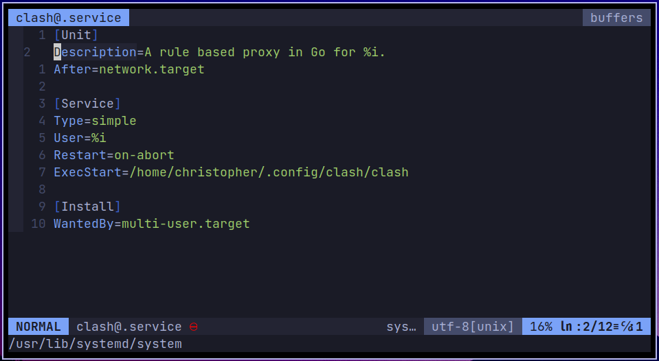
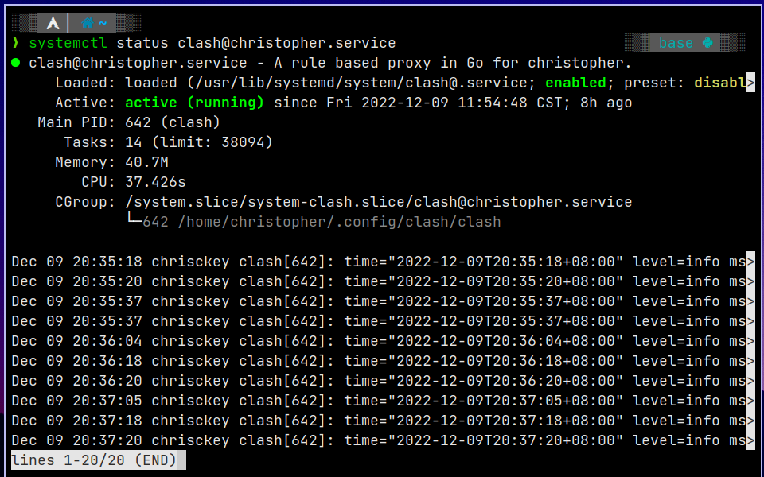

* Since I live in China mainland, some specific websites can't get accessed without a `Vpn` service running on the laptop. I managed to get one using [clash](https://github.com/Dreamacro/clash) and [configuration](ikuuu.live). However, I have to run `./clash -d .` manually every-time I need access, which is inconvenient. Since I've been using Linux, I did some search and managed to set up a system task that runs automatically after booting. Here is the Memo

<!-- more -->

1. Add `clash@.service` in `/usr/lib/systemd/system/` or in `/etc/systemd/system/` 

<center>
  <br>
  <div style="color:orange; border-bottom: 1px solid #d9d9d9;display: inline-block;color: #999;padding: 2px;">Example</div>
</center>

```systemd
[Unit]
Description=A rule based proxy in Go for %i.
After=network.target

[Service]
Type=simple
User=%i
Restart=on-abort
ExecStart=/home/christopher/.config/clash/clash

[Install]
WantedBy=multi-user.target
```

2. Use `systemctl` to enable and start mission.

<center>
  <br>
  <div style="color:orange; border-bottom: 1px solid #d9d9d9;display: inline-block;color: #999;padding: 2px;">Systemd Management</div>
</center>

