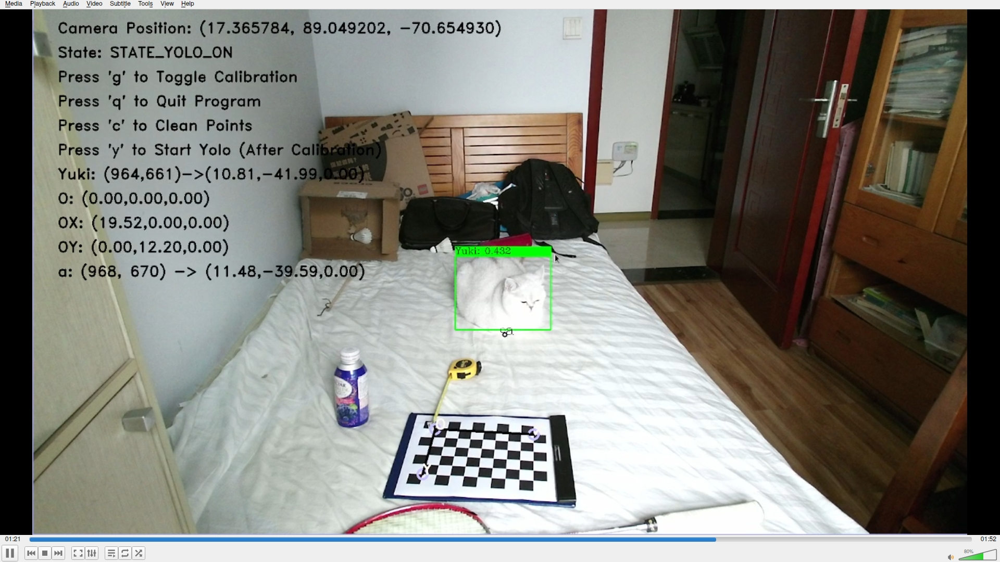
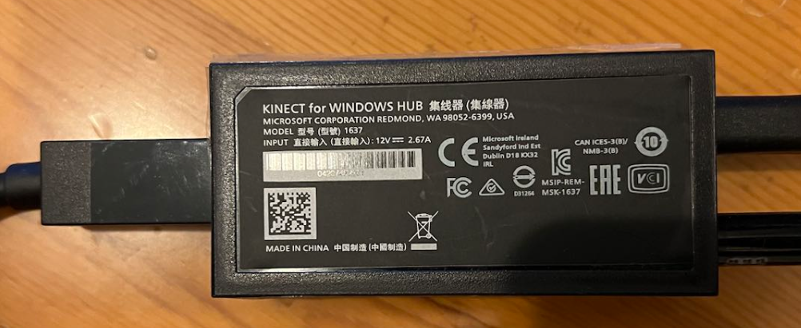
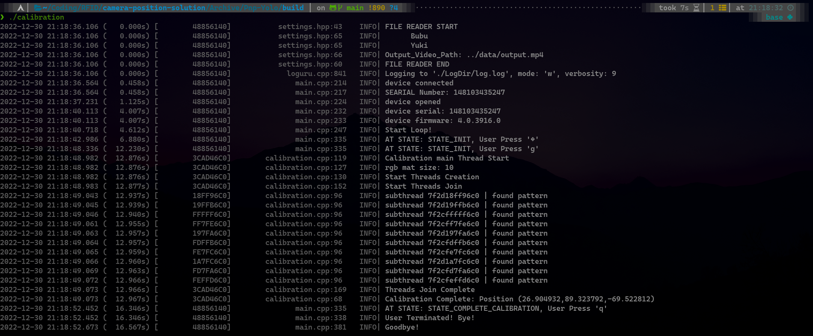
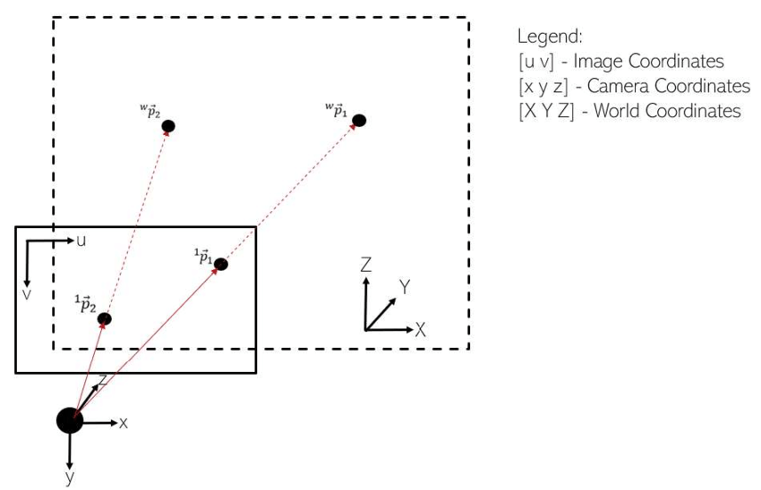

* Project Repo: [KinectV2 Camera Calibration and `Yolov5` Recognition](https://github.com/ChrisVicky/KinectV2-calibration-and-Yolov5-recognition)
* 2022-12-30 19:11
* This is a subproject from [camera-position-solution](https://github.com/ChrisVicky/camera-position-solution).

## Background

We are assigned the mission to combine KinectV2 Camera and a Robot car to construct a system that automatically calculate the camera's position and can tell where some objects are only according to camera's perspective (Of course here we use Yolov5 to recognize objects);

In this part, we use the chess board instead of the robot car to accomplish the calibration part and then calculate a perspective transformation matrix that maps points in the image (aka pixel coordinates) to the desk (or bed) coordinates.

<!-- more -->




## Project Structure

```
.
├── build                         -- build Dir
├── CMakeLists.txt                -- Top Cmake Configuration
├── data                          
│   └── output.mp4                -- Output Data -> stacks of imshown frames
├── default.xml                   -- Default Configuration File (example)
├── include 
│   ├── calibration.hpp           -- Calibration -> Future change: With Robot
│   ├── define.hpp                -- Define COLORS etc
│   ├── dnn.hpp                   -- Use OpenCV DNN APIs
│   ├── main.hpp                  -- Main Program
│   └── settings.hpp              -- Read Settings
├── logsrc                        -- Log Helper by loguru
│   ├── CMakeLists.txt
│   ├── loguru.cpp
│   └── loguru.hpp
├── models                        -- Trained Yolov5 Modules
│   ├── yolov5n.onnx
│   ├── yolov5s.onnx
│   ├── yolov5.xml
│   └── yuki-bubu-2022-12-23.onnx 
├── README.md                     
└── src                           
    ├── calibration.cpp
    ├── dnn.cpp
    └── main.cpp
21 directories, 87 files
```

## Dependency

  We use two libraries: [Libfreenect2](https://github.com/OpenKinect/libfreenect2) and [OpenCV](https://github.com/opencv/opencv).

  > Note that: You should set `freenect2_DIR` and include `freenect2_INCLUDE` directions if you install `libfreenect2` in custom directories.

  ```cmake
# Set up libfreenect2
# Set include dir and DIR for libfreenect2 if it is not installed globally
# SET(freenect2_DIR /home/christopher/Coding/libfreenect2/freenect2/lib/cmake/freenect2)
# include_directories(/home/christopher/Coding/libfreenect2/freenect2/include/)
find_package(freenect2 REQUIRED)
  ```

## Program Usage

  1. Install Dependencies shown above
  2. Run the following commands to build the project
  ```
  mkdir -p build && cd build
  cmake ..
  cmake --build .
  ```
  3. Plug in KinectV2 via USB (you might need a hub)


  4. run `./calibration` to start program


## Developer Diary

  To meet the need, we have to conquer four difficulties.
  1. KinectV2 Connection
  2. OpenCV Calibration
  3. Object Detection
  4. Planes Transformation
### 1. KinectV2 Connection

Since we develop the program on multiple Operating Systems (OS), we decide to take advantage of [Libfreenect2](https://github.com/OpenKinect/libfreenect2) which is open-sourced and supports Linux, Windows and Mac-OS. 
  > To install Libfreenect2, we simply go through the steps described on the README page of the project. Note that I'm running the Arch Linux with 6.0.12 Linux Kernel at the time of this post, and the lib works fine.

To use KinectV2, we need the following steps:

#### 1.1. Define Basic Variables, either globally or locally.
```cpp
libfreenect2::Freenect2 freenect2;      // libfreenect2 entity
libfreenect2::PacketPipeline *pipeline; // libfreenect2 pipeline
libfreenect2::Freenect2Device *device;  // device
libfreenect2::SyncMultiFrameListener listener(libfreenect2::Frame::Color);
libfreenect2::FrameMap frames;
```
#### 1.2. Initialize the `device` via certain APIs

```cpp
/* -------------------- START Kinectv2 Initialization -------------------- */
if(freenect2.enumerateDevices() == 0){
  LOG_F(ERROR, "no device connected!");
  return -1;
} else {
  LOG_F(INFO, "device connected");
}
string serial = freenect2.getDefaultDeviceSerialNumber();
LOG_F(INFO, "SEARIAL Number: %s",serial.c_str());
pipeline = new libfreenect2::CpuPacketPipeline();
device = freenect2.openDevice(serial, pipeline); if(device == 0){
  LOG_F(ERROR, "failed to open device: %s", serial.c_str());
  return -1;
} else {
  LOG_F(INFO, "device opened");
}
kinect_shutdown = false;
device->setColorFrameListener(&listener);
device->start();
LOG_F(INFO, "device serial: %s" ,device->getSerialNumber().c_str());
LOG_F(INFO, "device firmware: %s" ,device->getFirmwareVersion().c_str());
/* -------------------- END Kinectv2 Initialization -------------------- */
```

#### 1.3. We shall start a Loop to receive frames from the Device

```cpp
while(!kinect_shutdown){
  if(!listener.waitForNewFrame(frames, timeout))
    LOG_F(WARNING, "Frame Received Failed after timeout: %d", timeout);
  libfreenect2::Frame *rgb = frames[libfreenect2::Frame::Color];
  /* -------------------- START Frame Processing -------------------- */
  /* -------------------- END Frame Processing -------------------- */
  listener.release(frames);
}
```

#### 1.4. Before Exit, we need to manually stop and close the device
```cpp
device->stop();
device->close();
```
> We must define a `sigint_handler` to handle crash-down exit, or the device just go on pushing frames to stack via USB and never stops until the computer shutdown.
```cpp
void sigint_handler(int s){
  device->stop();
  device->close();
  exit(s);
}
// Usage 
signal(SIGINT, sigint_handler); // Savely Close the Device before sudden exit
```

#### 1.5. To take advantage of OpenCV APIs, we convert `libfreenect2::Frame` to `cv::Mat` right at the beginning of `Frame Processing`.
```cpp
cv::Mat(rgb->height, rgb->width, CV_8UC4, rgb->data).copyTo(kinect_mat);
cv::flip(kinect_mat, kinect_mat, 1);
rgb_mat = cv::Mat::zeros(kinect_mat.size(),CV_8UC3);
mixChannels(kinect_mat, rgb_mat, {0,0,1,1,2,2});
```
> Note that: `libfreenect2::Frame` contains 4 channels while our yolov5 model takes only 3-channel inputs, so we perform a `mixChannels()` here to reduce the last one.

---

### 2. OpenCV Calibration

To be more specified, in our original plan, the robot car, armed with SLAM, would provide information in 3D-world-coordinate-system while the KinectV2 camera shall recognize the car via some sort of object-recognition technic (e.g. [YoloV5](https://github.com/ultralytics/yolov5)) and provides its position in 2D-pixel-coordinate-system. Timestamp enables us to match them up, forming a set of 2D-3D points pair. Therefore, the problem turns into a [Perspective-n-Point(aka `PnP`)](https://docs.opencv.org/4.x/d5/d1f/calib3d_solvePnP.html) problem, and it has been solved long ago. OpenCV provides multiple APIs that implement nearly every solution posted literally.

However, because of the COVID-19 lockdown, I was separated from my teammates and I only have the KinetV2 camera by hand. Thus, I use built-in calibration functionality with chessboard to obtain the set of 2D-3D points pair to accomplish the task.

We perform 4 steps to meet the need.

#### 2.1. Collect multiple frames where the camera and chessboard are relatively still.
```cpp
if(STATE == STATE_START_CALIBRATION)
  cali_frames.push_back(rgb_mat);
```
> Note that: We use `STATE` to control the program. In fact, the whole program is designed on a Finite-State Machine(FSM).

#### 2.2. Run `findPattern` to obtain feature points' position in 2D-pixel-coordinate-system.
```cpp
vector<Point2f> point_buff;
int board_flag = CALIB_CB_ADAPTIVE_THRESH | CALIB_CB_NORMALIZE_IMAGE | CALIB_CB_FAST_CHECK;
int found = findChessboardCorners(rgb_mat, boardSize, point_buff, board_flag);
```
> Note that: We use `PThread` to accelerate the process, finding patterns in all collected frames at once.

#### 2.3. Collect all 2D information and calculate 3D-world-coordinate-system information.
```cpp
int found=0;
for(int i=0;i<size;++i){
  void * ret;
  pthread_join(thread_ids[i], &ret);
  runCalibrationRet retVal = *(runCalibrationRet*) ret;
  if(retVal.found){
    if(!found)
      d2s = retVal.d2;
    else
      for(int j=0;j<d2s.size();j++) d2s[j] += retVal.d2[j];
    found ++;
  }
}
```
```cpp
for(int i=0;i<boardSize.height; ++i)
  for(int j=0;j<boardSize.width; ++j)
    d3s.push_back(Point3f(j*squareSize, i*squareSize, 0));
```
> Note that: 3D-world-coordinate-system information is defined manually. The chessboard is the perfect coordinate system.

#### 2.4. Wrap them up and perform `solvePnP` to get `rvec` and `tvec`
```cpp
solvePnP(d3s, d2s, camera_matrix, dist_coeffs, rvec, tvec);
```
> Note that:`camera_matrix` and `dist_coeffs` are both 'known' parameters. They can be obtained either through manufacturer or calibrated by programs. OpenCV provides one API and with a little patch shall we be able to calibrate it.

#### 2.5. To obtain camera position, we still need another step that takes both `rvec` and `tvec` as input and `camera_position` would be obtained.
```cpp
int type_tv = tv.type();
Mat rvf(3,3,type_tv);
// Convert from vector rv(3x1) to matrix rotation(3x3)
Rodrigues(rv, rvf);
// The Inversed Matrix
Mat rvf_1(3,3,type_tv);
invert(rvf, rvf_1, DECOMP_SVD);
Mat Position = rvf_1 * (-tv);
Point3f p(Position);
```
> Note that: In Computer Vision, there are four basic coordinate systems and here we use the 'extrinsic' matrix, which converts between 3D-world-coordinate-system and 3D-camera-coordinate-system, to calculate camera position. For detail: [OpenCV `Pnp` reference](https://docs.opencv.org/4.x/d5/d1f/calib3d_solvePnP.html).

> Also note that: `Rodrigues` is essential, the output, `rvec` is (3x1), reference: [Rodrigues](https://docs.opencv.org/4.x/d9/d0c/group__calib3d.html#ga61585db663d9da06b68e70cfbf6a1eac)

---

### 3. Object Detection

According to our original plan, the KinectV2 Camera should recognize the Robot car in order to obtain its position in 2D-pixel-coordinate-system. So I perform a test with the famous [YoloV5 Project](https://github.com/ultralytics/yolov5).

The hardest part here is not the training part, YoloV5 provides a rather simple API to format data and train it on pre-trained models (reference: [Train on Custom Data](https://github.com/ultralytics/yolov5/wiki/Train-Custom-Data)). The hardest part is to mix the model in C++ program. After some research, I find that OpenCV provides APIs `cv::dnn` that load `.onnx` models and can run forward actions, or deduction.

In this part, I use my two cats as dataset. In the following steps, I would demonstrate the way to set up datasets, train model and use the model via OpenCV APIs.

#### 3.1. Dataset Creation

Simply follow steps described on [this page](https://github.com/ultralytics/yolov5/wiki/Train-Custom-Data). The output should be similar as below:
```
.
├── data.yaml
├── README.dataset.txt
├── README.roboflow.txt
├── test
├── train
└── valid
9 directories, 382 files
```

#### 3.2 Train model 

Simply put datasets in yolov5 directory and perform the following command and sit back to wait for the results

```
python train.py --img 640 --batch 16 --epochs 3 --data data.yaml --weights yolov5s.pt
```
> Note that: You should clone yolov5 repo before training and of course set up python environment. 

#### 3.3 Convert model to `.onnx`

YoloV5 takes PyTorch as backend, thus, the models are saved as `.pt` format. However, `cv::dnn` prefers `.onnx` format. Thus, a conversion shall be performed.

At this point (2022-12-30), the transformation based on the default dependency of YoloV5 is not compatible with the latest version of OpenCV `dnn` module. I have posted an [Issue](https://github.com/ultralytics/yolov5/issues/10575) on this to YoloV5 and get the information that it is the OpenCV that can not decode the model. Somehow, I manage to conquer the issue by downgrading some essential packages. My anaconda environment configuration is uploaded within the project.

After the correction of Dependency, we perform the following command to export `.onnx` from `.pt`.

```
python export.py --weights yolov5s.pt --include onnx
```

#### 3.4 Load `.onnx` with OpenCV

```cpp
cv::dnn::Net net = cv::dnn::readNetFromONNX(model_path);
net.setPreferableBackend(cv::dnn::DNN_BACKEND_OPENCV);
net.setPreferableTarget(cv::dnn::DNN_TARGET_CPU);
```

#### 3.5 Format Input Data
```
cv::Mat blob;
int col = frame.cols;
int row = frame.rows;
int _max = max(col, row);
input_img = cv::Mat::zeros(_max, _max, CV_8UC3);
frame.copyTo(input_img(cv::Rect(0, 0, col, row)));
cv::dnn::blobFromImage(input_img, blob, 1./255., cv::Size(INPUT_WIDTH, INPUT_HEIGHT), cv::Scalar(), true, false);
```

#### 3.6 Forward Network
```
net.setInput(input);
std::vector<cv::Mat> outputs;
net.forward(outputs, net.getUnconnectedOutLayersNames());
```

#### 3.7 Format the output

The output of the model, as the result of network-forwarding, is defined as follows:
```
 structure of `output.data`
┌─┬─┬─┬─┬─┬────────┬─────────────────────►
│0│1│2│3│4│5 ......│dimensions
├─┼─┼─┼─┼─┼────────┼─┬─┬─┬─┬─┬────────┬──►
│x│y│w│h│c│[scores]│x│y│w│h│c│[scores]│..
└─┴─┴─┴─┴─┴────────┴─┴─┴─┴─┴─┴────────┴──►
 c: confidence
```
Basically, it is an array that can be accessed via its address. The code is too large to be shown here.

#### 3.8 Transfer Output to `Detection`

For easy access, we transfer the output to the following data format.
```
struct Detection{
	int       class_id;   // Result's class id
	float     confidence; // Probability
	cv::Rect  box;        // Where it is
};
```

#### 3.9 Draw Boxes around Targets

```
int detection_size = output.size();
for(int i=0;i<detection_size;++i){
	auto detection = output[i];
	auto box = detection.box;
	auto class_id = detection.class_id;
	const auto color = color_list[class_id%color_list.size()];
	cv::rectangle(frame, box, color, 2);
	cv::rectangle(frame, cv::Point(box.x, box.y - 20), cv::Point(box.x + box.width, box.y), color, cv::FILLED);
	cv::putText(frame, cv::format("%s: %.3f",s.classifications[class_id].c_str(),detection.confidence), cv::Point(box.x, box.y - 5), cv::FONT_HERSHEY_COMPLEX, 0.6, BLACK);
}
```

---

### 4. Plane Transformation

Finally, we convert any points on the 2D-pixel-coordinate-system to its position in the 3D-world-coordinate-system. However, according some hard math, it is not possible to convert 2D to 3D without a given plane. Shown below, here is a model of Computer Vision (Reference: [ResearchGate](https://www.researchgate.net/figure/Display-of-Various-Coordinate-Systems-for-a-Computer-Vision-System-i-i-i-i-1-i_fig2_337311806))



Take the example of the transformation of Point $^1p_1$. The 3D position of it can be anywhere on the line of $O\ ^1p_1$, not necessary be at Point $^wp_1$ unless we require the 3D position lies on a particular plane.

Thus, in our case, we explicitly define that the Z axis of the object must be 0, meaning that we only provide the position of it on the ground $XOY$ axis and not provide the height.

Then, the problem is simplified to calculate a transformation between two planes. Here we take advantage of another API by OpenCV: [`getPerspectiveTransformation`](https://docs.opencv.org/4.x/da/d54/group__imgproc__transform.html#ga20f62aa3235d869c9956436c870893ae). According to the definition below, the input `src` and `dst` must be vertices of a quadrangle. And the return value shall be the transformation matrix.


#### 4.1 Calculate Transformation Matrix
In our project, we take 4 vertices of the chessboard to be the input.

```cpp
vector<Point2f> desk;
for(auto d3:d3s) desk.push_back(Point2f(d3.x,d3.y));
Point2f in[4];
Point2f out[4];
#define helper(_in, in_) \
_in[0] = in_[i0]; \
_in[1] = in_[i1]; \
_in[2] = in_[i2]; \
_in[3] = in_[i3]
int i0 = 0, i1 = boardSize.width-1;
int i2 = boardSize.width * (boardSize.height-1);
int i3 = boardSize.width * boardSize.height - 1;
helper(in, d2s);
helper(out, desk);
#undef helper
// NOTE: According to reference (Opencv), 
// getPerspectiveTransform takes quadrangle vertices in the source image
pix23D = getPerspectiveTransform(in, out);
```

#### 4.2 Calculate Corresponding 3D Position

`perspectiveTransformation` have already done for us.

```
vector<Point2f> out;
vector<Point2f> in; in.push_back(p2);
cv::perspectiveTransform(in, out, pix23D);
Point3f ret = Point3f(out[0].x,out[0].y,0);
```

---


## Summary

Till now, the Project is half-way finished and seems pretty simple, only takes advantage of existing Methods, APIs and Models. In the next semester, we would combine the robot car to accomplish the original plan. 

The next aim of our project would be human-skeleton detection and action deduction with it. And finally, takes some WiFi-Sensor Information would enable us to build a more robust and more complete in-home monitor system.


