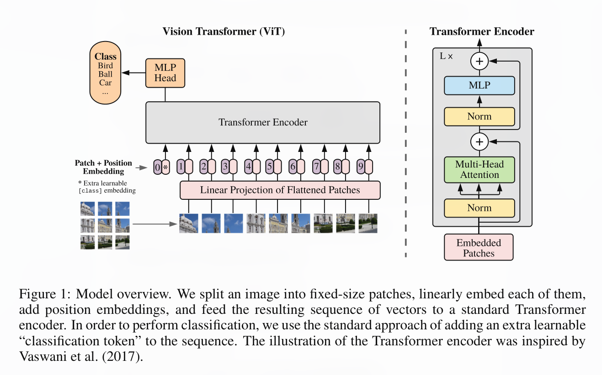

<center>
    <br>
    <div style="color:orange; border-bottom: 1px solid #d9d9d9;display: inline-block;color: #999;padding: 2px;">Title</div>
</center>

* cite: Dosovitskiy, Alexey, et al. "An image is worth 16x16 words: Transformers for image recognition at scale." arXiv preprint arXiv:2010.11929 (2020).
* available online: https://arxiv.org/pdf/2010.11929.pdf
* Date: 2023-01-15 22:07

## Brief summary


* What is the problem the paper is trying to solve?
  * How can we reduce CNNs in transformer models in image classification tasks?
  * How to treat an Image as a sequence of data?

* What are the key ideas of the paper? Key insights?
  * A new way to treat an image sequencially.
  * An image is divided into 16x16 2D patches and are transfered sequencially into an out-of-box self-attention transformer encoder, followed by MLP Heads which result in classification predictions.


* What is the key contribution to the literature at the time it was written?
  * First to reduce entirely the CNNs in usage of transformer in image classification tasks and propose a pure transformer model called Vision Transformer (ViT).
  * Maybe the first to propose a sequencial treatment on an image.

* What are the most important things you take out from it?
  * A possible way to treat an image as a sequence of data while preserving some relative information.
  * Designing easy-to-use models that utilize out-of-box interfaces could be a good way of conducting creative methods that solve difficult problems.
 
## Strengths (Most Important Ones)

* Does the paper solve the problem well?
  1. First of all, it is true that the solution, or more precisely, the new model proposed can be a possible solution that treat an image in a sequencial way.
  2. Second, the computational latency can be low in this case since the division is as small as 16x16, and therefore the computational complexity can be relatively at a low level.

## Weaknesses (Most Important Ones)

* Room for improvement.
  1. The way to treat the image as a sequence of data is too straight-forward. The information on the boaders between patches can be lost.
  2. The patches are produced with a fixed number of sequences, making the model difficult to perform on images with hight resolution, and since nowadays people have a preference of taking high resolution pictures, the methods proposed may not be practical in reallife without further improvements.
  3. Also, the model requires a large quantity of data for training, significally improving the training costs.

## How can we do better? Your ideas and thoughts.
1. To include more relative information between patches, I guess one way is to introduce an additional division that stands on the boarder of the original one. A possible implementation is shown below.
```
 ┌───┬───┬───┐   ┌─┬───────┬─┐    ┌─┬─┬───┬─┬─┐
 │   │   │   │   ├─┼───────┼─┤    ├─┼─┼───┼─┼─┤
 ├───┼───┼───┤   │ │       │ │    ├─┼─┼───┼─┼─┤
 │   │   │   │ + │ │       │ │ => │ │ │   │ │ │
 ├───┼───┼───┤   │ │       │ │    ├─┼─┼───┼─┼─┤
 │   │   │   │   ├─┼───────┼─┤    ├─┼─┼───┼─┼─┤
 └───┴───┴───┘   └─┴───────┴─┘    └─┴─┴───┴─┴─┘
       A               B                C
```
> Where `A` is the method in the paper and `B` is the additional sequence to provide extra information. But again, this additional patche can further worsen the situation of high overall computational costs.

2. The high computational costs in high resolution image processing may be decreased by parellel hardware devices.

## What have you learnt/enjoyed/disliked in the paper? Why?
* The most impressive thing I take away from this paper is the methodology that the model is designed to utilize the API of original Transformer model which has been implemented and optimized for efficient performance. This way of design is simple, yet creative and meaningful.

<!-- !! No more than Half a pape -->


